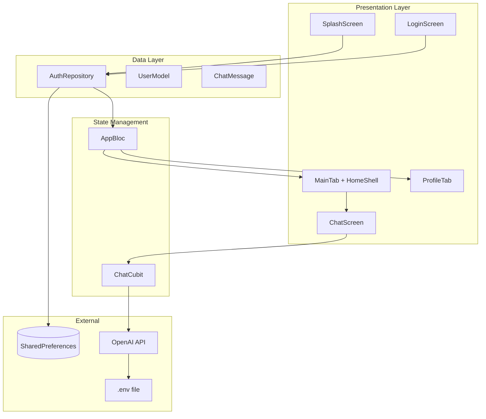

# Chicks — Full Project Documentation

> **Chicks** — your personal AI fashion stylist (Flutter mobile app)  
> Version: `1.0.0+1` | Dart `>=3.0.0` | Flutter `>=3.10.0`

---

## Table of Contents

1. [Introduction](#1-introduction)
2. [Documentation Index](#2-documentation-index)
3. [Architecture](#3-architecture)
4. [Modules & Features](#4-modules--features)
5. [Application Flow](#5-application-flow)
6. [Dependencies](#6-dependencies)
7. [Setup Instructions](#7-setup-instructions)
8. [Environment Variables](#8-environment-variables)
9. [OpenAI Integration](#9-openai-integration)
10. [Firebase Integration](#10-firebase-integration)
11. [Localization](#11-localization)
12. [UI & Theming](#12-ui--theming)
13. [Known Limitations](#13-known-limitations)
14. [Future Improvements](#14-future-improvements)
15. [Contributing & Maintenance](#15-contributing--maintenance)

---

## 1. Introduction

Chicks is a cross-platform Flutter application that helps users make fashion decisions through an AI-powered stylist chat. The MVP delivers:

- User onboarding (splash, login)
- A branded home experience
- Real-time stylist conversation via OpenAI GPT-4o-mini
- Profile management and sign-out

The project uses **feature-first** organization, **BLoC/Cubit** for state, and **GoRouter** for navigation.

---

## 2. Documentation Index

| Document | Description |
|----------|-------------|
| [ARCHITECTURE.md](./ARCHITECTURE.md) | Technical architecture, layers, routing, data flow |
| [BUSINESS_REQUIREMENTS.md](./BUSINESS_REQUIREMENTS.md) | Goals, audience, MVP scope, business value |
| [SYSTEM_REQUIREMENTS.md](./SYSTEM_REQUIREMENTS.md) | Functional/non-functional requirements |
| [TEST_CASES.md](./TEST_CASES.md) | Manual QA and test scenarios |

---

## 3. Architecture

### 3.1 High-Level Diagram



### 3.2 Directory Structure

```
lib/
├── main.dart
├── app.dart
├── core/
│   ├── constants/       # app_constants, asset_paths
│   ├── router/          # app_router.dart, route_names.dart
│   ├── services/        # openai_chat_service.dart, collection_names.dart
│   ├── theme/           # app_theme, app_colors, app_brand_colors
│   └── utils/           # logger
├── data/
│   ├── models/          # user_model, chat_message
│   └── repositories/    # auth_repository
├── features/
│   ├── app/bloc/        # AppBloc, AuthState, AppEvent
│   ├── splash/ui/
│   ├── login/ui/
│   ├── home/ui/         # home_shell, main_tab
│   ├── profile/ui/
│   └── chat/            # bloc, ui, widgets
├── widgets/
├── ui_kit/
└── l10n/
```

### 3.3 State Management Summary

| Component | Type | Scope | Responsibility |
|-----------|------|-------|----------------|
| `AppBloc` | BLoC | Global | Auth status, `UserModel` |
| `ChatCubit` | Cubit | Chat screen | Messages, loading, errors |

### 3.4 Routing Summary

**File:** `lib/core/router/app_router.dart`

Singleton: `AppRouter.router`

| Path | Screen |
|------|--------|
| `/` | Splash |
| `/login` | Login |
| `/registration` | Registration |
| `/home/main` | Main (in shell) |
| `/home/profile` | Profile (in shell) |
| `/chat` | Chat (root overlay) |

---

## 4. Modules & Features

### 4.1 Splash (`features/splash`)

- Animated logo and tagline
- Waits `AppConstants.splashDelaySeconds` (2 s)
- Routes via `AuthRepository.isLoggedIn`

### 4.2 Login (`features/login`)

- Google Sign-In button UI
- Calls `AuthRepository.signInWithGoogle()` (local MVP)
- `BlocListener<AppBloc>` → `context.go(/home/main)` on success
- Link to registration screen

### 4.3 Home (`features/home`)

**`HomeShell`**
- Material 3 `NavigationBar` (Home / Profile)
- Pink indicator `#FFD6E8`

**`MainTab`**
- User avatar + localized greeting
- Feature cards:
  - **Wardrobe** — placeholder `onTap`
  - **Stylist Chat** — `context.pushNamed('chat')`
  - **Your Style** — placeholder `onTap`
- Staggered entrance animation (opacity + slide; cards remain tappable)

### 4.4 Chat (`features/chat`)

| File | Role |
|------|------|
| `chat_screen.dart` | Scaffold, `BlocProvider`, list, input |
| `chat_cubit.dart` | `sendMessage`, error handling |
| `chat_state.dart` | `messages`, `isLoading`, `error` |
| `chat_message_bubble.dart` | Left/right bubbles |
| `chat_typing_indicator.dart` | Loading bubble |
| `chat_input_bar.dart` | TextField + send button |

**Session behavior:** History lives in `ChatCubit` only; leaving the screen clears it.

### 4.5 Profile (`features/profile`)

- User info display
- Sign-out confirmation dialog
- `AppSignOutRequested` → login route

### 4.6 Legacy / Unused Screens

Not registered in router (safe to ignore or remove later):

- `features/app/ui/home_screen.dart`
- `features/app/ui/wardrobe_screen.dart`
- `features/app/ui/profile_screen.dart`
- `features/app/bloc/app_state.dart` (orphan `WardrobeState` mock chat)

---

## 5. Application Flow

### 5.1 Startup Sequence

```text
main()
  ├─ WidgetsFlutterBinding.ensureInitialized()
  ├─ dotenv.load(fileName: ".env")
  ├─ AuthRepository.instance.initialize()
  ├─ SystemChrome.setPreferredOrientations(portrait)
  └─ runApp(App())
        ├─ BlocProvider(AppBloc)
        └─ MaterialApp.router(routerConfig: AppRouter.router)
```

### 5.2 Authentication Flow

```text
[Logged out]
  Splash → Login → Sign In → AppBloc.authenticated → Home

[Logged in]
  Splash → Home

[Sign out]
  Profile → Confirm → AppBloc.unauthenticated → Login
```

### 5.3 Chat Flow

```text
Home → Tap "Чат со стилистом"
  → push /chat
  → ChatCubit created
  → User sends message
  → OpenAiChatService.completeConversation()
  → Assistant bubble added
  → Back → pop to Home
```

---

## 6. Dependencies

### 6.1 Production (`pubspec.yaml`)

```yaml
dependencies:
  flutter: sdk
  flutter_localizations: sdk
  flutter_dotenv: ^6.0.1
  http: ^1.2.1
  cupertino_icons: ^1.0.5
  go_router: ^13.0.0
  shared_preferences: ^2.2.2
  provider: ^6.1.2
  intl: ^0.20.2
  flutter_bloc: ^8.1.6
  bloc: ^8.1.4
  equatable: ^2.0.5
  flutter_svg: ^2.0.10+1
  image_picker: ^1.1.2
  logger: ^2.7.0
```

### 6.2 Dev

```yaml
dev_dependencies:
  flutter_test: sdk
  flutter_lints: ^3.0.0
```

### 6.3 Assets

```yaml
flutter:
  assets:
    - .env
    - assets/svg/
```

---

## 7. Setup Instructions

### 7.1 Prerequisites

- Flutter SDK `>=3.10.0`
- Dart SDK `>=3.0.0`
- Android Studio / Xcode (for mobile targets)
- OpenAI API account and API key

### 7.2 Clone & Install

```bash
git clone <repository-url>
cd chicks
flutter pub get
```

### 7.3 Environment Setup

```bash
cp .env.example .env
```

Edit `.env`:

```env
OPENAI_API_KEY=sk-your-key-here
```

> **Important:** Save the file on disk (not only in the editor). An empty `.env` causes `EmptyEnvFileError` at startup.

### 7.4 Run the App

```bash
# List devices
flutter devices

# Run on Android emulator/device
flutter run

# Or specify device
flutter run -d <device_id>
```

### 7.5 Code Generation (Localization)

After editing `lib/l10n/*.arb`:

```bash
flutter gen-l10n
# or
flutter pub get   # if generate: true in pubspec
```

### 7.6 Troubleshooting

| Issue | Solution |
|-------|----------|
| `flutter_dotenv` not resolved | Save `pubspec.yaml`; run `flutter pub get` |
| `EmptyEnvFileError` | Add `OPENAI_API_KEY=...` to `.env` on disk |
| Chat card does nothing | Hot restart (`R`); verify route `/chat` in router |
| OpenAI 401 | Check API key validity |
| Stale build | `flutter clean && flutter pub get` |

### 7.7 Reload Guide (Development)

| Change type | Action |
|-------------|--------|
| UI/widgets | Hot reload (`r`) |
| Routes, main, Cubit, `.env` | Hot restart (`R`) |
| pubspec dependencies/assets | Full `flutter run` |

---

## 8. Environment Variables

| Variable | Required | Description |
|----------|----------|-------------|
| `OPENAI_API_KEY` | Yes (chat) | OpenAI secret key for Chat Completions |

**Files:**

- `.env` — local secrets (gitignored)
- `.env.example` — template for developers (committed)

**Loading:** `main.dart` → `await dotenv.load(fileName: ".env")`  
**Access:** `dotenv.env['OPENAI_API_KEY']` in `OpenAiChatService`

**Security note:** Keys in mobile assets can be extracted. Use a backend proxy before production release.

---

## 9. OpenAI Integration

### 9.1 Service

**Class:** `OpenAiChatService` (`lib/core/services/openai_chat_service.dart`)

| Setting | Value |
|---------|-------|
| Endpoint | `https://api.openai.com/v1/chat/completions` |
| Model | `gpt-4o-mini` |
| Method | POST JSON |

### 9.2 System Prompt (Summary)

The AI acts as **Chicks personal fashion stylist**:

- Tone: friendly, modern, stylist assistant
- Language: Russian only
- Format: concise, structured, occasional emoji
- Topics: outfits, combinations, trends, capsule wardrobe
- Limits: no invented wardrobe facts; stay on fashion topics

### 9.3 Request Body Structure

```json
{
  "model": "gpt-4o-mini",
  "messages": [
    { "role": "system", "content": "<system prompt>" },
    { "role": "user", "content": "..." },
    { "role": "assistant", "content": "..." }
  ]
}
```

### 9.4 Error Handling

| Condition | Behavior |
|-----------|----------|
| Missing API key | `OpenAiChatException` → SnackBar |
| HTTP != 200 | Parse `error.message` if present |
| Empty choices | Exception with Russian message |
| Network failure | Generic internet error in `ChatCubit` |

---

## 10. Firebase Integration

### 10.1 Current Status: **Not Active**

- `firebase_auth`, `cloud_firestore`, `google_sign_in` are **not** in `pubspec.yaml`
- `AuthRepository` uses **SharedPreferences** for MVP
- `lib/core/services/collection_names.dart` defines `users` collection (prep for Firestore)

### 10.2 Planned Architecture

```text
UI → AppBloc → AuthRepository → FirebaseAuthService
                              → FirestoreService (user profile)
```

### 10.3 Integration Checklist (Future)

1. Add to `pubspec.yaml`:
   - `firebase_core`
   - `firebase_auth`
   - `google_sign_in`
   - `cloud_firestore`
2. Run `flutterfire configure`
3. Add `google-services.json` / `GoogleService-Info.plist`
4. Implement `FirebaseAuthService` wrapping Auth + Google Sign-In
5. Replace mock `AuthRepository.signInWithGoogle()` with Firebase flow
6. Store user profile in Firestore (`CollectionNames.users`)
7. Add `SERVER_CLIENT_ID` to `.env` for Google OAuth (Android)

### 10.4 Environment Variables (Firebase, Planned)

| Variable | Purpose |
|----------|---------|
| `SERVER_CLIENT_ID` | Google OAuth web client ID (Android) |

---

## 11. Localization

| File | Locale |
|------|--------|
| `lib/l10n/app_en.arb` | English (template) |
| `lib/l10n/app_ru.arb` | Russian |

**Config:** `l10n.yaml` → output `lib/l10n/generated/`

**Usage:**

```dart
final loc = AppLocalizations.of(context);
Text(loc.tabMain);
```

**Coverage:** Splash, login, tabs, profile chrome. Home feature cards and chat UI use hardcoded Russian strings in MVP.

---

## 12. UI & Theming

### 12.1 Brand Colors (`AppBrandColors`)

| Token | Hex | Usage |
|-------|-----|-------|
| Pink | `#FF4FA0` | Primary accent |
| Background | `#FFF0F5` | Screen background |
| Icon BG | `#FFE4F2` | Card icons |
| Title | `#2D1A24` | Dark text |

### 12.2 Material Theme (`AppTheme`)

Uses Material 3 purple scheme (`AppColors`) — applied to login and components using `Theme.of(context)`.

### 12.3 UI Kit

- `AppButton` — themed button
- `AppLoadingIndicator` — circular progress from theme primary

---

## 13. Known Limitations

1. **Auth is local mock** — not production Google/Firebase OAuth
2. **API key in app bundle** — security risk for production
3. **No chat persistence** — history lost on leaving chat
4. **No automated test suite** — manual QA per `TEST_CASES.md`
5. **Wardrobe / Style features** — UI placeholders only
6. **Mixed localization** — partial Russian hardcoding
7. **`AppConstants.appName`** still says `Kumbel` (legacy string)

---

## 14. Future Improvements

### Short Term

- [ ] Wire real Google Sign-In + Firebase Auth
- [ ] Persist chat history (local DB or Firestore)
- [ ] Unit tests for `OpenAiChatService` and `ChatCubit`
- [ ] Backend proxy for OpenAI API key
- [ ] Move all UI strings to ARB files

### Medium Term

- [ ] Digital wardrobe (photo upload, item tagging)
- [ ] Style profile questionnaire
- [ ] Streaming AI responses (SSE)
- [ ] Rate limiting and usage quotas

### Long Term

- [ ] Personalized recommendations from wardrobe data
- [ ] Social sharing of outfits
- [ ] Premium subscription tier
- [ ] Retailer affiliate integrations

---

## 15. Contributing & Maintenance

### Code Style

- Follow `analysis_options.yaml` / `flutter_lints`
- Run `flutter analyze` before PRs
- Feature-first: new screens under `features/<name>/`

### Branching (Suggested)

- `main` — stable
- `develop` — integration
- `feature/*` — new features

### Key Commands

```bash
flutter pub get
flutter analyze
flutter test          # when tests exist
flutter clean         # after asset/dependency changes
```

---

## Appendix A: Route Reference

```dart
// lib/core/router/route_names.dart
RouteNames.splash        // '/'
RouteNames.login         // '/login'
RouteNames.registration  // '/registration'
RouteNames.main          // '/home/main'
RouteNames.profile       // '/home/profile'
RouteNames.chat          // '/chat'
```

## Appendix B: Core Classes Quick Reference

| Class | Location |
|-------|----------|
| `App` | `lib/app.dart` |
| `AppRouter` | `lib/core/router/app_router.dart` |
| `AppBloc` | `lib/features/app/bloc/app_bloc.dart` |
| `AuthRepository` | `lib/data/repositories/auth_repository.dart` |
| `OpenAiChatService` | `lib/core/services/openai_chat_service.dart` |
| `ChatCubit` | `lib/features/chat/bloc/chat_cubit.dart` |
| `ChatScreen` | `lib/features/chat/ui/chat_screen.dart` |

---

*Last updated: project MVP documentation — Chicks v1.0.0+1*
